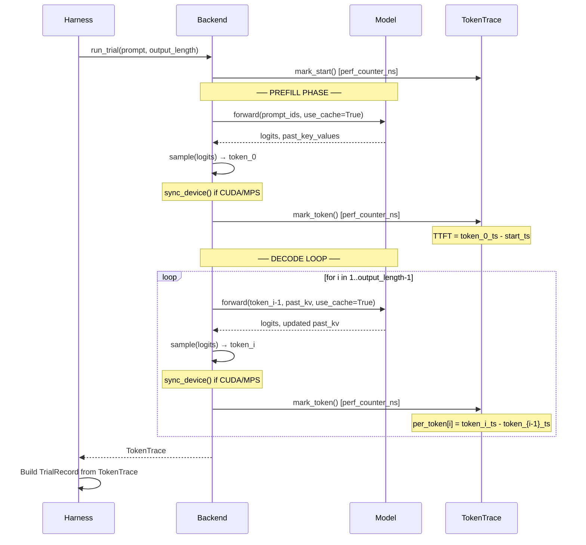

# Timing Diagram: Benchmark Measurement Pipeline

## Overview

This document describes exactly **when** and **how** timestamps are captured
during a benchmark trial. Understanding the measurement pipeline is critical
for interpreting results and reasoning about measurement artifacts.

## Measurement Points



## Timer Selection by Device

| Device | Timer | Sync Method | Resolution | Notes |
|--------|-------|-------------|------------|-------|
| CPU    | `perf_counter_ns` | None needed | ~ns | Most reliable |
| CUDA   | `perf_counter_ns` + `cuda.synchronize()` | `torch.cuda.synchronize()` at each mark | ~μs | Sync ensures GPU work is complete |
| MPS    | `perf_counter_ns` + `mps.synchronize()` | `torch.mps.synchronize()` | ~μs | May include queue delays |

## What Each Metric Captures

### TTFT (Time to First Token)
```
TTFT = timestamp(token_0) - timestamp(start)
     = prefill_time + first_decode_step + sampling_time + sync_overhead
```

TTFT includes the full prefill (proportional to prompt length²) plus one
decode step. It is the latency a user would experience before seeing
the first output character.

### Per-Token Latency
```
per_token[i] = timestamp(token_i) - timestamp(token_{i-1})
             = attention(seq_len=prompt+i) + mlp + layernorm + lm_head + sampling + overhead
```

Note: `per_token[0]` is not reported (it would overlap with TTFT).
The first few per-token values include cache warmup effects within the
decode loop, hence the `steady_state_skip` parameter.

### End-to-End
```
e2e = timestamp(last_token) - timestamp(start)
    = TTFT + sum(per_token[1:])
```

### Throughput
```
throughput = n_generated_tokens / (e2e / 1000)  [tok/s]
```

## Warmup vs. Trial

```
Run:
  [warmup_0] [warmup_1] [warmup_2]  ←── discarded
  [trial_0]  [trial_1]  ... [trial_9]  ←── recorded
                                            ↓
                                    IQR filter → summary stats
```

## Steady-State Extraction

Within each trial's per-token trace:
```
[token_0, token_1, | token_2, token_3, ..., token_N]
 ↑ skip=2 skipped  | ↑ steady-state tokens used for summary
```

## Known Measurement Artifacts

1. **First decode tokens**: Often slower due to KV cache allocation and
   memory layout initialization. Mitigated by `steady_state_skip`.

2. **CUDA sync overhead**: Each `synchronize()` call adds ~1-5 μs.
   Acceptable for ms-scale measurements; may distort sub-μs timings.

3. **MPS queue batching**: MPS may batch small operations, causing
   timestamps to cluster rather than reflect true kernel timing.

4. **OS scheduling**: Context switches can cause outlier spikes.
   IQR filtering removes these, but raw traces are preserved.

5. **Thermal throttling**: Extended runs (>30s) may see gradual latency
   increase. Multiple short trials are more robust than few long ones.
